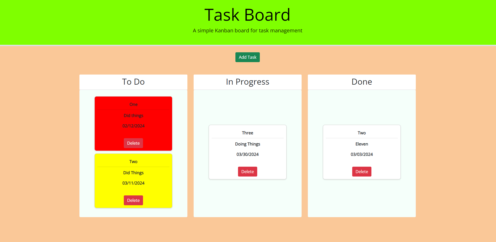

# Challenge-5---Task-Board

Task Board Third Party API Challenge Repository

This is a task board application that allows the user to create a task card and drag or drop it into the following areas: To Do, In Progress, and Done. Task's that are nearing the deadline within 7 days will have a yellow background, while tasks that are past deadline will have a red background.

Repository Link: https://github.com/hiltyalec/Challenge-5---Task-Board

Deployed Application Link: https://hiltyalec.github.io/Challenge-5---Task-Board/